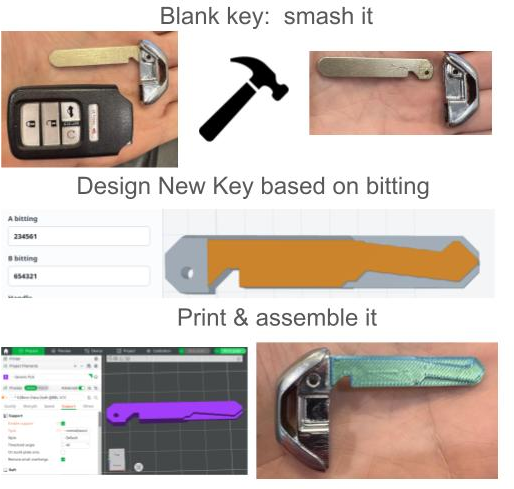

# HON66 Key Generator



Browser-based HON66 key geometry generator with live 3D preview and STEP/STL export.

Make Your Key Now!: [GitHub Pages](https://ccrome.github.io/honda-hon66-key-generator/)

Repository: [origin](https://github.com/ccrome/honda-hon66-key-generator)

## Warning

This is a convenience tool for geometry exploration, not a recommendation to put plastic in a Honda ignition. Honda keyways are already a pain, and a shitty plastic key can make them worse. A failed part can snap in the ignition, jam the cylinder, and turn into an expensive removal or repair job. Do not use the output in an ignition or any other critical lock unless you have verified fit, strength, and safe removal first.

## What It Does

This app generates a parametric HON66-style key model from A/B bitting values. It runs the CAD model directly in the browser using OpenCascade WebAssembly through `replicad`, previews the result with Three.js, and exports the generated solid as either STEP or STL.

It also exports a six-piece HON66 key decoder set. Each decoder is an L-shaped gauge for one of the six bitting depths. The measuring tip is thinned with a chamfer so it can sit against the webbing and read the distance to the cut.

Current defaults:

- A bitting: `234561`
- B bitting: `654321`
- Key thickness: `3mm`
- Handle: octagonal bow

The handle selector includes:

- `Octagonal bow`: standard bow-style handle with a through hole.
- `Keyless`: rectangular/keyless-style handle with the keyless-specific notch and top chamfer.

## Key Decoding

The decoder exports are meant to help read an existing HON66-style key by comparing the cut depth against six fixed gauges:

1. Export either the `1-color decoder` or `2-color decoder`.
2. Print the decoder set.
3. Put the L-shaped measuring tip against the key webbing at a cut position.
4. Find the decoder that sits flush against the cut.
5. Record that decoder number as the bitting depth for that position.
6. Repeat for all six positions on side A and side B.

Decoder export options:

- `1-color decoder`: single-material print, debossed numbers only. Print right side up.
- `2-color decoder`: separate second-color number fill objects. Print upside down so the top surface stays flat.

The decoders are geometry aids, not calibrated commercial locksmith tools. Verify against known keys or actual measured depths before trusting the decoded bitting.

## Privacy

The app runs entirely in your browser. No key data is stored locally or sent to a server. For extra privacy, use an incognito or private browser window.

## Safety

This generator produces a model, not a guaranteed working key. A finished part can break in use, including in an ignition cylinder, which can leave debris behind and lead to expensive removal or repair work. Do not use the output on an ignition or any other critical lock unless you have verified fit, strength, and a safe way to remove a failed part.

## Filament Guidance

For non-critical test fitting, stronger engineering filaments are the least bad 3D-printing options:

- Recommended: ASA, nylon/PA, PA-CF, or polycarbonate from a well-tuned printer.
- Might be okay: PETG, especially for light fit checks.
- Definitely not recommended for functional keys: standard PLA, resin/SLA prints, flexible TPU/TPE, silk PLA, wood-filled, metal-filled, glow-in-the-dark, marble, and other brittle or decorative filaments.

PLA is only reasonable for fit checks. It is a poor choice for temperature-sensitive use.

This does not make a printed key safe for ignition use. For anything load-bearing or critical, use a properly cut metal key blank.

## Local Development

Requirements:

- Node.js 20 or newer
- npm

Install dependencies:

```bash
npm ci
```

Start the dev server:

```bash
npm run dev
```

Open:

```text
http://localhost:5173/
```

Build the production site:

```bash
npm run build
```

Preview the production build locally:

```bash
npm run preview
```

## GitHub Pages

The repository includes a GitHub Actions workflow at `.github/workflows/pages.yml`.

On every push to `main`, GitHub Actions will:

1. Install dependencies with `npm ci`.
2. Build the app with `npm run build`.
3. Upload `dist/` as a GitHub Pages artifact.
4. Deploy it to GitHub Pages.

In GitHub repository settings, set Pages source to `GitHub Actions`.

The Vite config uses `base: "./"` so the app works when hosted under a repository path such as:

```text
https://ccrome.github.io/honda-hon66-key-generator/
```

## Project Layout

- `src/hon66Model.ts`: Parametric CAD model and geometry generation.
- `src/main.ts`: Browser UI, Three.js preview, and export handling.
- `src/styles.css`: App styling.
- `.github/workflows/pages.yml`: GitHub Pages deployment workflow.
- `vite.config.ts`: Vite build configuration.

## Export Formats

The generated model can be exported as:

- `STEP`: Preferred CAD interchange format.
- `STL`: Mesh format for slicers and quick inspection.

The decoder set can also be exported as STEP or STL in either 1-color or 2-color form.

## Notes

This is a modeling tool, not a guarantee that an exported key will be mechanically correct or safe to use. Verify dimensions and behavior against your actual requirements before manufacturing anything.

## License

The source code and project files are available under the custom noncommercial license in [`LICENSE`](./LICENSE). Generated keys, models, and export files are not restricted by that license and may be used commercially.
